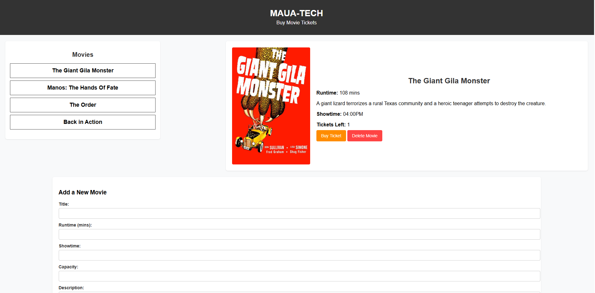

# Flatdango

## Overview
Flatdango is a simple web application that allows users to browse and purchase movie tickets. It provides an intuitive interface where users can view available movies, check details such as runtime and showtime, purchase tickets, and even add new movies to the system.

## Features
- Display a list of available movies.
- View detailed information about a selected movie.
- Purchase tickets for a movie (updates available ticket count dynamically).
- Delete movies from the list.
- Add new movies to the system.
- Fetch movie data from a JSON server.

## Technologies Used
- **HTML** for structuring the webpage.
- **CSS** for styling and layout.
- **JavaScript (Vanilla JS)** for interactivity and API communication.
- **JSON Server** to simulate a backend for storing movie data.

## Setup and Installation
### Prerequisites
Ensure you have the following installed:
- [Node.js](https://nodejs.org/)
- JSON Server (`npm install -g json-server`)

### Steps to Run Locally
1. Clone this repository:
   ```sh
   git clone https://github.com/your-username/Flatdango.git
   cd Flatdango
   ```
2. Install dependencies:
   ```sh
   npm install
   ```
3. Start the JSON server:
   ```sh
   json-server --watch db.json --port 3000
   ```
4. Open `index.html` in a browser to use the application.

## File Structure
```
Flatdango/
│── index.html         # Main HTML file
│── style.css          # Stylesheet for UI design
│── script.js          # JavaScript for app functionality
│── db.json            # JSON server database file (mock API)
```

## API Endpoints
- **GET /films** - Fetch all available movies.
- **GET /films/:id** - Fetch a specific movie.
- **PATCH /films/:id** - Update ticket count after purchase.
- **DELETE /films/:id** - Remove a movie from the list.
- **POST /films** - Add a new movie.

## How to Use
1. Browse the list of available movies in the sidebar.
2. Click on a movie title to view details.
3. Click "Buy Ticket" to purchase a ticket (updates ticket count dynamically).
4. Click "Delete Movie" to remove the movie from the database.
5. Use the "Add Movie" form to add a new movie to the database.

## Screenshot


### Homepage




### Add New Movie 


## Future Improvements
- Implement user authentication for personalized ticket booking.
- Add a seat selection feature for each movie.
- Integrate a real database backend instead of a mock JSON server.
- Improve UI/UX with animations and better styling.

## Contributing
Feel free to contribute by submitting pull requests or reporting issues.
1. Fork the repository.
2. Create a new branch (`git checkout -b feature-branch`).
3. Commit your changes (`git commit -m 'Add new feature'`).
4. Push to the branch (`git push origin feature-branch`).
5. Open a Pull Request.

## License
This project is open-source and available under the [MIT License](LICENSE).

